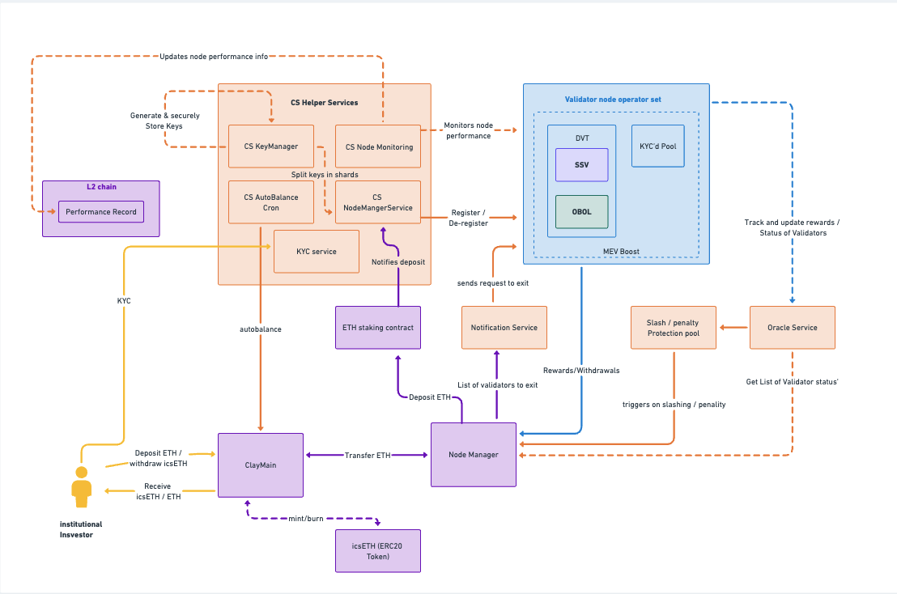

# Architecture

ClayStack employs a modular and adaptable design that combines a hybrid architecture, where liquid tokens are supported by a network of validating nodes utilizing diverse technologies. Through the integration of modular DVT technology, ClayStack brings together SSV, Obol, and KYC-ring-fenced nodes, offering redundancy, resistance to censorship, and scalability. The primary objective of IcsETH is to streamline ETH staking for institutional investors by providing security, high yields, and whitelisted entry. It addresses the specific demands of institutions by offering a permissioned product that delivers the same level of excellence expected from a top-tier liquid staking protocol. As IcsETH is exclusively designed for institutions, only whitelisted users can mint it, and there will also be a minimum ETH deposit requirement.

Read more about icsETH [here](./csETH)

#### [DVT Modular Implementation](../cseth/dvt)
A modular DVT system is a novel approach to network security and decentralization, enabling distributed validation among multiple participants. ClayStack integrates SSV and Obol, enhancing security, fault tolerance, and large-scale decentralization. It also introduces private and public professional node pools, supporting scalability, fungibility, and DeFi integration while adhering to stringent institutional requirements.

#### MEV Extraction

ClayStack validators utilize MEV extraction tools like MEV-Boost to maximize yields. These tools capitalize on the ability of validators to manage transaction order within their blocks, leading to additional profits. This proactive approach sets the standard for MEV utilization, benefiting all participants in the ClayStack ecosystem.

#### Flash Exit
ClayStack's Flash Exit feature provides instant liquidity to token holders, eliminating the need to wait through the usual unbonding period or the risk of slashing until the claim is ready. It allows csETH holders to instantly exit their position in exchange for a fee, which is then distributed among the remaining csETH holders, thereby increasing the value of their holdings.

Flash Exit is made possible by reserving a portion of staked funds within the contract to act as a liquidity pool. In a Flash Exit transaction, no unstaking from the validating nodes occurs. Instead, the withdrawn funds are directly sourced from the contract's token balance. This feature is beneficial in scenarios where immediate liquidity is required, thus adding another layer of flexibility for csETH token holders.

#### Permissioned Pools 

ClayStack will have separate permissioned pools to ensure maximal KYC/AML compliance. This is done to ensure maximum compliance for institutional participants. The node operators that will serve institutional participants are also whitelisted and will be checked against several security and decentralization standards. The ringfencing of the whitelist will be maintained by a Board of whitelisted institutional members, of which the ClayStack protocol will also be a constituent. 

#### Slash / Penalty Protection

Claystack primarily utilizes DVT for running validator nodes, which inherently mitigates the risk of missing attestations or malicious activities due to single node failures. However, to ensure the safety of institutional funds, Claystack maintains a pool dedicated to slash/penalty protection, providing an additional layer of security. In the event of slashing or penalties being applied, this pool is utilized to minimize the potential loss of funds. The purpose of this pool is to safeguard institutional investments and enhance overall fund security.

#### On-Chain Performance Record

Claystack adopts an on-chain approach to store information about all onboarded operators, enabling effective monitoring of node performance and status. This approach simplifies the process of adding new nodes and allows for the seamless replacement of underperforming nodes with higher-performing alternatives. Additionally, users can utilize the on-chain records to easily verify the overall performance and rewards of IcsETH. This on-chain infrastructure also facilitates the automation of a system designed to maximize user rewards, enhancing efficiency and user experience.

#### Auto Restaking (Autobalance)

With IcsETH, holders of IcsETH no longer need to concern themselves with reward claims or restaking. All rewards received by the protocol are automatically restaked to optimize the reward percentage. IcsETH is associated with a rate tied to the underlying asset, which determines the user's current holdings in the native token. These holdings represent both the principal and the accumulated rewards.

