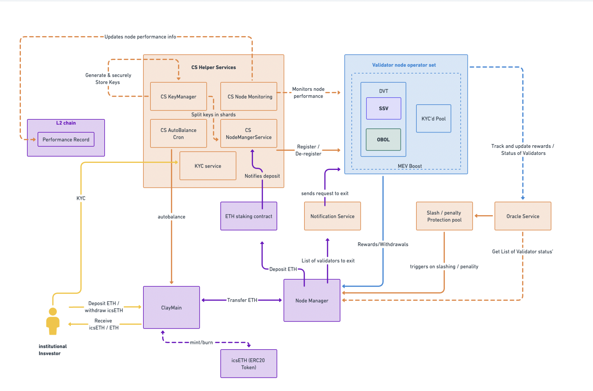

# Architecture

ClayStack offers a modular and composable design that combines a hybrid architecture whereby the liquid tokens are supported by a network of validating node leveraging various technologies. A modular DVT technology allows ClayStack to combine SSV, Obol, KYC-ring-fenced and public pools of nodes. At the same time, the operators are combined from professional node operators to small operators. The diversity provides a layer of redundancy and censorship resistance, while at the same time allows for full scalability and decentralization.

Read more about icsETH [here](./csETH)

#### [DVT Modular Implementation](../cseth/dvt)
A modular DVT system is a novel approach to network security and decentralization, enabling distributed validation among multiple participants. ClayStack integrates SSV and Obol, enhancing security, fault tolerance, and large-scale decentralization. It also introduces private and public professional node pools, supporting scalability, fungibility, and DeFi integration while adhering to stringent institutional requirements.

#### MEV Extraction

ClayStack validators utilize MEV extraction tools like MEV-Boost to maximize yields. These tools capitalize on the ability of validators to manage transaction order within their blocks, leading to additional profits. This proactive approach sets the standard for MEV utilization, benefiting all participants in the ClayStack ecosystem.

#### Flash Exit
ClayStack's Flash Exit feature provides instant liquidity to token holders, eliminating the need to wait through the usual unbonding period or the risk of slashing until the claim is ready. It allows csETH holders to instantly exit their position in exchange for a fee, which is then distributed among the remaining csETH holders, thereby increasing the value of their holdings.

Flash Exit is made possible by reserving a portion of staked funds within the contract to act as a liquidity pool. In a Flash Exit transaction, no unstaking from the validating nodes occurs. Instead, the withdrawn funds are directly sourced from the contract's token balance. This feature is beneficial in scenarios where immediate liquidity is required, thus adding another layer of flexibility for csETH token holders.

#### Permissioned Pools 

ClayStack will have separate permissioned pools to ensure maximal KYC/AML compliance. This is done to ensure maximum compliance for institutional participants. The node operators that will serve institutional participants are also whitelisted and will be checked against several security and decentralization standards. The ringfencing of the whitelist will be maintained by a Board of whitelisted institutional members, of which the ClayStack protocol will also be a constituent. 
