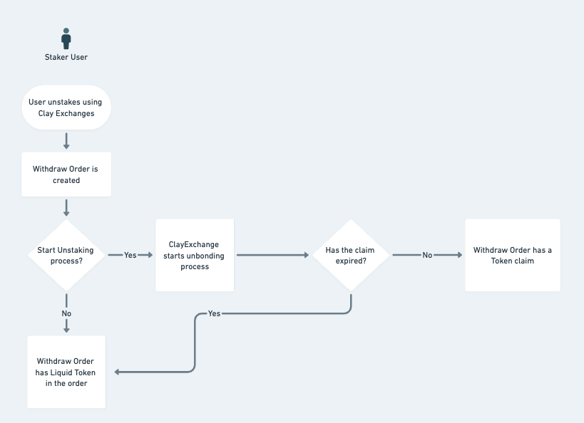
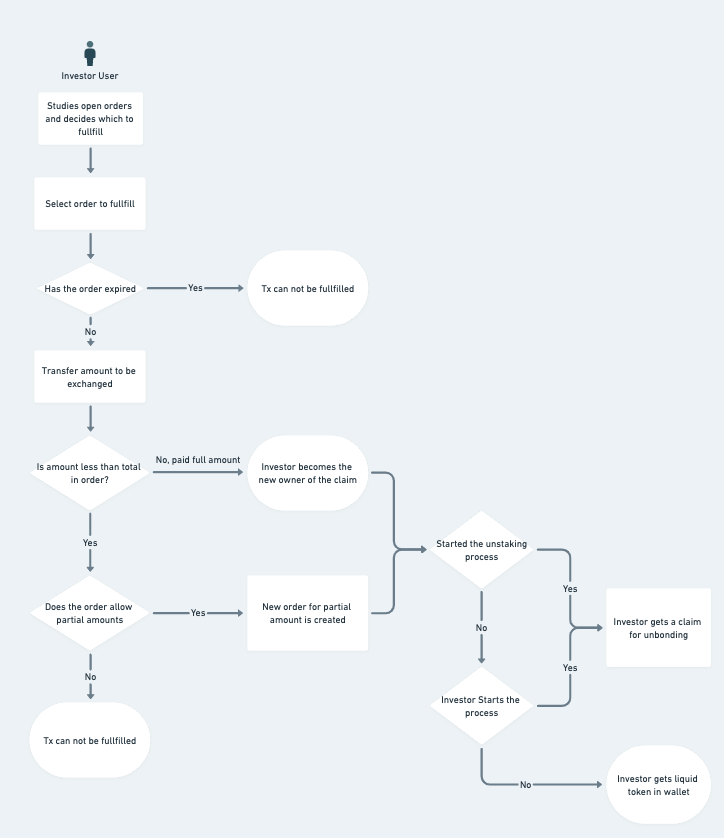

## Overview:

ClayExchange is a specialized decentralized exchange protocol that focuses on unstaking liquid tokens, understanding the unstaking/unbonding process and maximizes yield for liquidity providers while minimizing slippage and fees of liquid tokens holders.

## Contracts:

### ClayExchange:

This is the main entry point contract that coordinates the unstaking flow and allows other users to fulfil withdraw orders at a discount. In this contract the user starts an unstaking request by providing the parameters for the order to inform other users of their request to exit and the discount they are willing to give in order for their order to be fulfilled as soon as possible. These orders can then be viewed and fulfilled by other users who wish to buy the derivative tokens at the discount specified by the intial order's owner.

### Withdrawing order flow:

This is the process for a user to place an order to exchange liquid token for the base token.



A user who has a staked derivative token can place a withdraw order for the native token through clay exchange in an open market for other users to fulfill.

```solidity
function withdraw(address _token, uint256 _amount, uint256 _fee, uint256 _deadline, bool _allowPartial, bool _startUnstaking) returns (uint256);
```

The function parameters are as follows:

| Name         | Type      | Description                  |
| ------------ | --------- | ---------------------------- |
| `_token` | `address` | address of the liquid token to place an order for |
| `_amount` | `uint256` | liquid token amount they want to sell for base token |
| `_fee` | `uint256` | the discount they are willing to give any user in order to get the base token early and not wait the unbonding period. |
| `_deadline` | `uint256` | When the limit order expires in seconds from execution the order |
| `_startUnstaking` | `bool` | indicate whether or not the user has initiated the unstaking process implying the fulfiller will receive the base token as well but after the unbonding period is over. |
| `_allowPartial` | `bool` | indicate whether the order must be fulfilled in its entirety or can be fulfilled in partial by different users. |

> **Note:**
> Requirements:
> - `msg.sender` must have approved `_amount` of Token to this contract and must have a balance more than `_amount`.
> - returns uint256 `_orderId` of withdraw order created


**Post Order Features:**

1. UpdateOrder: After an order is created a user is also able to modify certain details of their order using the function below:

```solidity
function updateWithdrawOrder(uint256 _orderId, uint256 _fee, uint256 _deadline, bool _allowPartial, bool _unstake) external whenNotPaused nonReentrant returns (bool);
```

Updatable Parameters:

| Name         | Type      | Description                  |
| ------------ | --------- | ---------------------------- |
| `_orderId` | `uint256` | unique of order to be updated |
| `_fee` | `uint256` | The user can also update the fee/discount he set to reduce or increase the fees for remaining fulfillments.|
| `_deadline` | `uint256` | When the limit order expires in seconds from execution the order |
| `_allowPartial` | `bool` | indicate whether the order must be fulfilled in its entirety or can be fulfilled in partial by different users. |
| `_unstake` | `bool` | allows the user to start unstaking his tokens if the initial order did not start the unbonding process. However an already unstaked order cannot be reversed.  |


2. CancelOrder: the user can decide to cancel his order if it has not been completely fulfilled using by passing in the **orderId** to the function below:

```solidity
function cancelWithdrawOrder(uint256 _orderId) external whenNotPaused nonReentrant returns (bool);
```
| Name         | Type      | Description                  |
| ------------ | --------- | ---------------------------- |
| `_orderId` | `uint256` | unique of order to be cancelled. If the order has initiated unstaking the user will be able to claim their order once it has completed. Else the remaining liquid token will be refunded|

### Fulfilling Order Flow


Users with native tokens who wish to buy staked derivative tokens at a discount can choose an order they wish to fulfill using the function detailed below:

```solidity
function fulfill(uint256 _orderId, uint256 _amount, bool _start) external payable whenNotPaused nonReentrant returns (uint256);
```

Additionally these are the fulfiller determined parameters:

| Name         | Type      | Description                  |
| ------------ | --------- | ---------------------------- |
| `_orderId` | `uint256` | unique of order to be fulfiled |
| `_amount` | `uint256` | the amount of the initial order the user wants to fulfill. If the _allowPartial boolean on the initial order is false, the user must fulfill the order in full if he wishes to fulfill that specific order.|
| `_start` | `bool` | if the initial order has NOT started unstaking, the fulfiller can initiate the unstaking process if he wishes to receive the base token instead. However, if the initial order has already started unstaking, the user only has the option to receive the base token. |


### External Functions:

### getOrders()

Returns array of several user orders at once

```solidity
function getOrders(uint256[] calldata _orderIds) public view returns (UserWithdrawOrderInfo[] memory orders);
```
Parameters:

| Name         | Type      | Description                  |
| ------------ | --------- | ---------------------------- |
| `_orderIds` | `uint256[]` | Array of orderIds to get status for. |

### getUserOrders()

Returns the given page of the withdraw orders in descending order

```solidity
function getUserOrders(address _user, uint256 _page) external view returns (UserWithdrawOrderInfo[] memory, uint256, uint256);
```

Parameters:

| Name         | Type      | Description                  |
| ------------ | --------- | ---------------------------- |
| `_user` | `address` | Address of the user to get orders for |
| `_page` | `uint256` | page number of users orders|


### **Claim()**

Allows the user to claim several orders at once after the unbonding period is over.

```solidity
function claim(uint256[] calldata _orderIds) external whenNotPaused nonReentrant returns (bool);
```

Parameters:

| Name         | Type      | Description                  |
| ------------ | --------- | ---------------------------- |
| `_orderIds` | `uint256[]` | Array of orderIds to claim for. |


### orderAmounts()

Calculates the amount to fulfill after the discount and the fee that goes to the treasury

```solidity
function orderAmounts(uint256 _orderId, uint256 _amount) public view returns (uint256, uint256, uint256);
```
Parameters:

| Name         | Type      | Description                  |
| ------------ | --------- | ---------------------------- |
| `_orderId` | `uint256` | Id of the order to be calculated for|
| `_amount` | `uint256` | amount thats being fulfilled from the order|


> **Note:**
> Requirements:
> - will revert if `_amount` is greater than the initial order amount
> - returns uint256 `_amountBase` amount of native token after exchange rate applied, uint256 of base minus fee(discounted by user) and uin256 treasuryFee


### getExchangeRate()

Returns the current exchange rate from the underlying strategy contract

```solidity
function getExchangeRate(address _token) external view returns (uint256);
```

Parameters:

| Name         | Type      | Description                  |
| ------------ | --------- | ---------------------------- |
| `_token` | `uint256` | the address of the liquid token|


## Internal Functions:

### addStrategy()

allows the admins to add new liquid tokens to the protocol

### setFee()

allows the admins to set the percentage cut of the fee they are taking from each order as a protocol fee

### setTreasury()

allows the admins to set the address of the treasury for fees to be transferred to

### pause()

allows the admins to pause the contract which stops withdraws, fulfills and updates but not claims and cancels.

### unpause()

allows admins to restore normal state

### FxProtection:

The FxProtection is a feature to ensure that the rates calculated within the exchange contract deviate only within the predicted bounds of the yearly rates so as to ensure users cannot manipulate the exchange rate and game the system. When a new strategy is initialised, we update its FxInfo struct which stores the maxDeviation percentage in a year as well as the last calculated rates. Then, before each contract function is executed in ClayExchange, the fxProtection function runs to check that the current exchange rate the transaction is receiving is within the allowed deviation set on initialisation.

When the deviation is too far off, the fxProtection function locks withdrawals, fulfills and updates but allows users who have already created orders that have been unbonded to claim their tokens. This prevents users from gaming the system but does not deny other users from claiming and exiting.

When the contract is locked, the admins/dao can override this lock using overrideLock function to partially disable the lock if they have diagnosed that the increase in rates is valid e.g due to donations within the strategy increasing the rate to beyond the max deviation initially set. This is to prevent unnecessary downtime on the contract/protocol.

## Strategy Contracts:

These contracts allow us to interact with the underlying liquid staking protocols to allow us to perform stake and unstake orders for the underlying liquid staked token. This requires us to thorougly understand the underlying protocol and then develop a smart contract that will be audited as well as it deals with users funds. As a start we will offer the support for two tokens CSMatic and SAVAX. However, as the protocol grows, we aim to add more utility for the users by incorporating functionality for various liquid staked derivatives to allow users to enter/exit much quicker and with much lower fees.

### Roles:

### CS_SERVICE_ROLE:

ClayStack's backend service that has privilege to less critical functions.

ClayExchange.sol

- pause() -- pause the contract
- unpause() -- unpause the contract

### TIMELOCK_ROLE:

ClayStack implements a time lock where a given change has to be proposed on-chain and a time delay before it's executed. This allows for the users to be informed ahead of the change. The proposers and executors on the time lock are part of the core team.

ClayExchange.sol

- addStrategy() - add new liquid token strategies to Clayexchange
- updateStrategy() -  update existing strategy contracts
- setFee() - sets new fee percentage that protocol takes on orders

### TIMELOCK_UPGRADES_ROLE:

ClayStack implements a second more strict time lock. The proposers and executors on the time lock are part of the extended community and foundation.

- setTreasury() - sets the protocol’s treasury address
- upgradeTo() - upgrade the implementation of the proxy

### INTERNAL

A set of internal modifiers between contracts ensure only those contracts can perform the given functions.

1. OpenZepplin's modifier to restrict inheriting contract's initializing and upgrading functions. onlyProxy modifier-guarded functions in ClayExchange.sol & Strategy Contracts
    - initialize() -- initialize the contract's variables post-deployment.
    - upgradeTo() -- upgrade the implementation of the proxy to a new contract.
