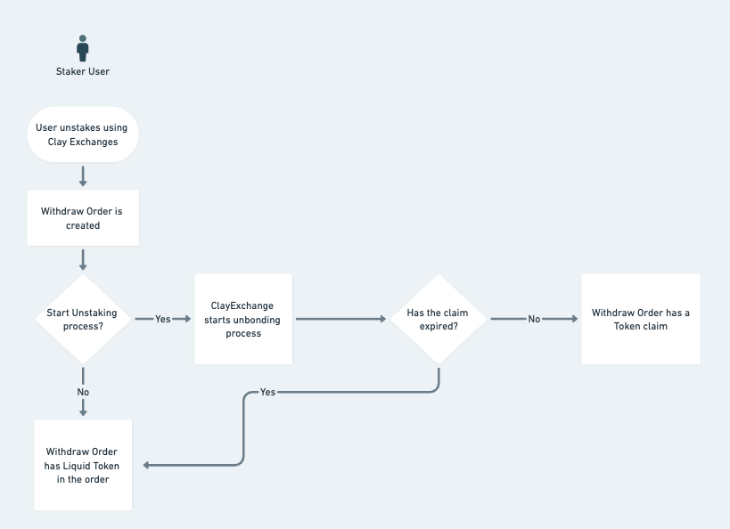

# Overview

ClayExchange is a specialized decentralized exchange protocol that focuses on unstaking liquid tokens, directly managing the unstaking/unbonding process interacting with the staking contracts and maximizes yield for liquidity providers while minimizing slippage and fees of liquid tokens holders.

It brings a two-sided market of people looking to stake that can receive better pricing (discounted liquid tokens) and people looking to unstake while minimizing time and fees.

### Supported Liquid Tokens

Each liquid token has its own characteristics and rules, specially applicable in the unbonding process. ClayExchange implements a specialized protocol for each of the supported liquid tokens enabling direct interaction with the original staking contracts, therefore not relying on liquidity pools for the swapping of liquid tokens for base tokens, but instead directly interacting with the staking contracts. This yields in capital efficiency benefits as lower fees are incurred, and there is no slippage, particularly beneficial for transactions with large amounts or in volatile market conditions.

### Staking Flow

For each supported liquid token the user is able to either directly stake their base token and receive the liquid token, or the user is able (automatically) to fulfill a market order to buy the liquid token at a discount.

### Fulfilling an order

There are two modalities for a user to fulfill a limit order. The user can decide to fulfill an order of a liquid token, thus at the time of fulfillment, the user receives liquid tokens in exchange for the base tokens at the current market rate minus the discount provided by the order owner. 

The second modality is orders where the owner decided to start the withdrawal (aka unbonding) process, in these cases the user fulfilling the order receives in lieu of the base tokens, the claim order for the liquid tokens, which can be redeemed at a later time, dependent on the conditions of each liquid token.

### Creating a sell order (sell or withdraw)

Similar to fulfilling an order as user looking to withdraw a liquid token can create a limit order to be sent to the market using two modalities.

In the first modality the user may decide to try to sell the liquid tokens at a discount, but may choose not to withdraw (aka unstake) the tokens at the same time, thus while the order remains, the user continues to accrue staking rewards and the person (or contract) on the other side will receive in turn the same liquid tokens when fulfilling the order.

In the second modality the user may decide to start the withdrawal process. In this scenario two outcomes can happen, given an attractive discount, someone will fulfill the order, and the owner of the order will receive the base tokens much earlier than the unbonding period. If there were to be no takers of the order during this time, the user will come back and claim (similarly to standard unstaking at the original liquid token contract) the base tokens.

### Exchange Rate Protection

The FxProtection is a feature to ensure that the rates originating from the staking protocols deviate only within the predicted bounds of the yearly rates to ensure no external factors may manipulate the contract or the funds. When a new strategy is added, tolerated deviations on the exchange rate are configured. In certain situations, e.g. in massive slashing events, where the exchange rate volatility may increase more than the historic norm, the contract will lock itself and an admins/dao override is required to resume operations.