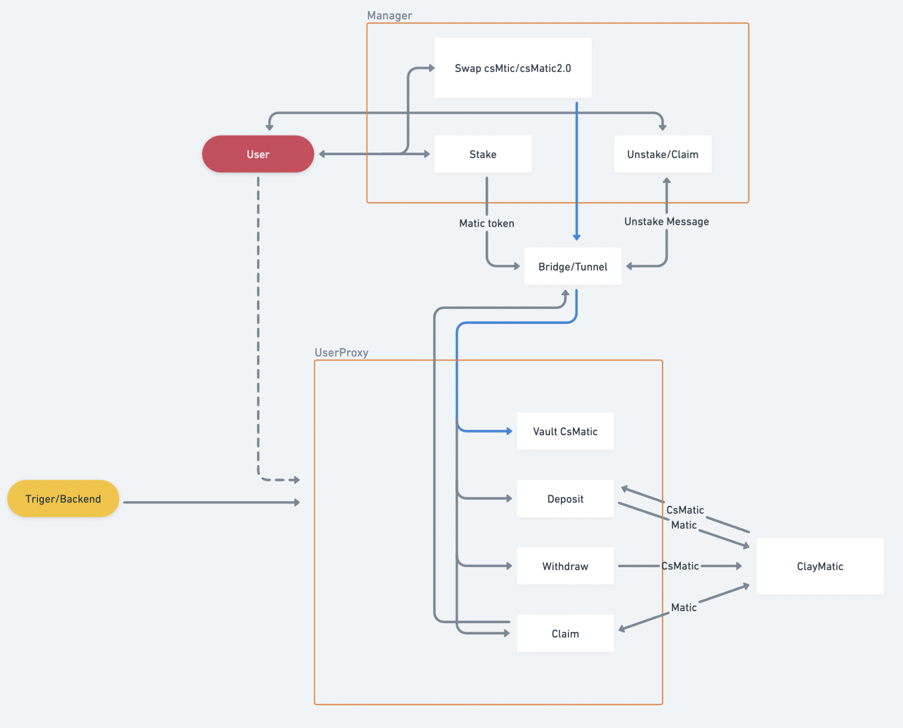

# csMATIC (Polygon)

ClayStack Staking on Polygon brings the capability to stake/unstake on Polygon by leveraging ClayMatic, ClayStack's direct PoS staking on Polygon's validators on Ethereum. The process is achieved by transferring (via the Polygon Plasma Bridge) state messages and minting csMATIC on Polygon.

The solution on Polygon will allow to user to stake and receive in exchange csMATIC (Polygon's version). The system then stakes the user provided MATIC and mints csMATIC on ethereum. Unstaking follows a similar process where the user burns the csMATIC and will wait the unbonding period in order to claim the bridged MATIC. The native (ethereum) staking/unstaking is not handled directly, but instead is taken care of by ClayMatic in isolation, i.e. the system, on ethereum acts as a proxy for the user action, but doesn't require the user to self bridge and pay for gas prices.

The process of staking/unstaking from Polygon uses a batching process where user's actions are aggregated and batched to handle ethereum staking/unstaking in batched with the aims of saving gas costs. Staking/Unstaking are netted i.e. deposits for staking may cover withdraw requests from users.

[Audit Report](https://certificate.quantstamp.com/full/cs-matic-liquid-staking-on-polygon-clay-stack)



## Contracts

### ClayManager

ClayManager allow users in the Polygon network to:

- Deposit: MATIC/wMATIC and receive in exchange csMATIC tokens.
- Withdraw: This functionality initiates the unstaking process by sending a message to ClayMatic contract (through the UserProxy contract). The staking on nodes is not handled directly in this protocol.
- Claim. this functionality allows the user to claim MATIC tokens once the unbounding period has passed.

View on [Polygonscan](https://polygonscan.com/address/0x318D1E3eF00115C4DF1e0D9af965A8bE8EA1f133).
```
0x318D1E3eF00115C4DF1e0D9af965A8bE8EA1f133
```

### UserProxy

The UserProxy contract receives messages from ClayManager and interacts with ClayMatic to stake/unstake tokens.
Claiming of unstake orders already submitted to ClayMain can be executed by anyone. This initiates the process of sending unclaimed MATIC from ethereum to Polygon, where Polygon users will be able to claim their individual orders.

View on [Etherscan](https://etherscan.io/address/0x318D1E3eF00115C4DF1e0D9af965A8bE8EA1f133).
```
0x318D1E3eF00115C4DF1e0D9af965A8bE8EA1f133
```

### ClaimVault

Funds transferred from ethereum to polygon are stored in a should, those funds are aimed to cover claims. The separation of this vault form the ClayManager contract is due to technical limitations. matic token contract send the tokens using `address.transfer` which has a limited gas stipend, this may cause the proxy contract to revert because of gas expenses.

### Deposit Flow

1. User approves and transfers MATIC to ClayManager contract. users receive csTokens that are valid only in Polygon.
2. autobalance() - public function - will bridge MATIC tokens to the UserProxy and send messages to indicating csMATIC on ethereum to mint on ClayMatic.
3. Funds and messages arrive to ethereum network (triggerred by the [Plasma Bridge](https://docs.polygon.technology/docs/develop/ethereum-polygon/plasma/erc20) withdraw process) and are processed by the UserProxy contract. This initiates the corresponding deposit function in ClayMatic and csMATIC tokens are received in an amount equal to the one minted in Polygon.

### Withdraw & Claim Flow

1. The user deposit csMATIC tokens and created a claim order that will track amount and time to claim.
2. Autobalance will request through a message to UserProxy to withdraw the required amount of MATIC. When the message is decoded, a request to withdraw funds is passed to ClayMatic, thus in turn starting the unbonding period.
3. After the unbounding process, claims are available to be collected. this function can be called by anyone, resulting in the MATIC funds being bridged back to Polygon.
4. Users are then able to execute their claims of MATIC in Polygon.