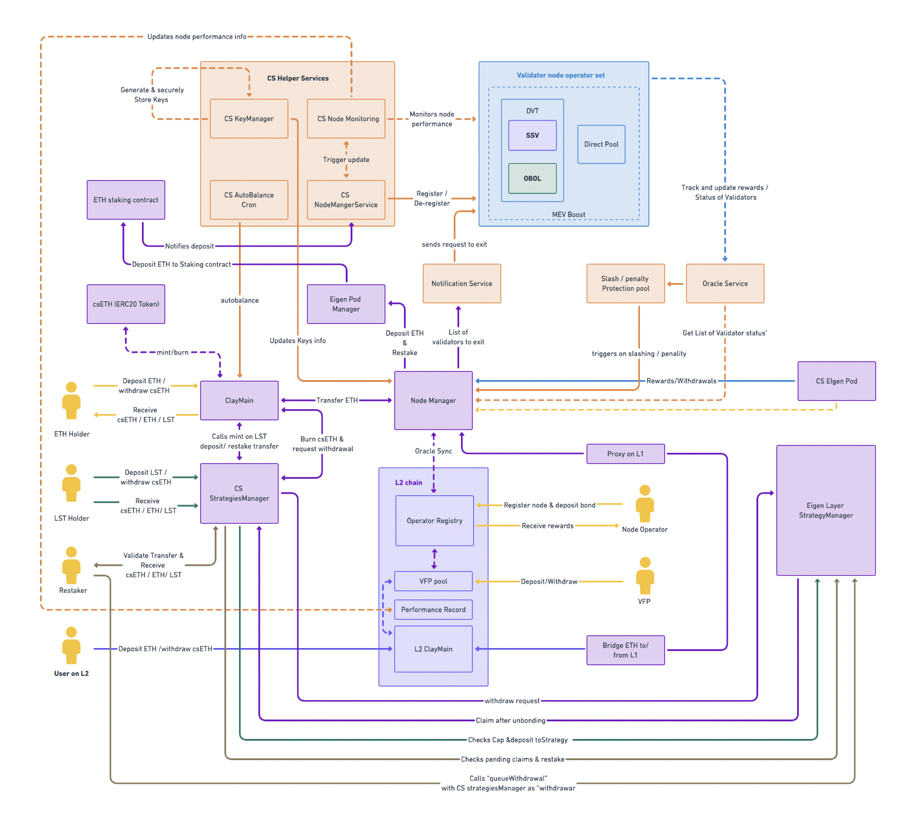

# Architecture

csETH is a modular and composable design that combines a hybrid architecture whereby the liquid tokens are supported by a network of validating node leveraging various technologies. A modular DVT technology allows csETH to combine SSV, Obol, KYC-ring-fenced and public pools of nodes. At the same time, the operators are combined from professional node operators to small operators. The diversity provided a layer of redundancy and censorship resistance, while at the same time allows for full scalability and decentralization.

#### [DVT Modular Validation](./dvt)

A modular DVT system is a novel approach to network security and decentralization, enabling distributed validation among multiple participants. csETH integrates SSV and Obol, enhancing security, fault tolerance, and large-scale decentralization. It also introduces private and public professional node pools, supporting scalability, fungibility, and DeFi integration, while adhering to stringent institutional requirements.

#### [Validator Funding Provider (VFP)](./vfp)

csETH promotes decentralization by lowering the bond requirement for validators through a performance-based protocol. Validator Fund Providers (VFPs) contribute ETH to a high-risk pool, which is used to meet validator bond requirements. VFPs earn higher rewards but also share the associated risks with validators.

#### L2 Node Operator Management (L2NOM)

Layer 2 Node Operator Management (L2NOM) is a cutting-edge protocol designed to streamline the management and interaction of node operators with csETH on Layer 2 (L2) chains. This protocol provides node operators with the tools necessary to claim rewards, submit proposals for node allocations, monitor their nodes, and maintain their performance reputation.

L2NOM takes full advantage of the benefits provided by Layer 2 solutions to achieve its functionalities. The scalability and efficiency of L2 chains allow for large-scale operations that would be cost-prohibitive on the base layer. As a result, L2NOM significantly reduces gas costs, which is a crucial factor for node operators who need to perform frequent or complex transactions.

The following are the key functionalities provided by L2NOM:

- Reward Claiming: Node operators can efficiently claim their rewards on the L2 chain, reducing gas costs and speeding up the process compared to Layer 1 chains.

- Proposal Submission: Node operators can submit proposals for node allocations on the L2 chain. This enables a more democratic process for node allocations, as it lowers the barrier to entry and allows more operators to participate.

- Node Monitoring: L2NOM provides tools for node operators to monitor the performance of their nodes. This allows operators to quickly identify and address any issues, ensuring optimal performance and reliability.

- Performance Reputation: Node operators can maintain and improve their performance reputation through the L2NOM. A good performance reputation increases the likelihood of receiving additional node allocations, providing an incentive for operators to maintain high standards of operation.

#### MEV Extraction

csETH validators will utilize MEV extraction tools like MEV-Boost to maximize yields. These tools capitalize on the ability of validators to manage transaction order within their blocks, leading to additional profits. This proactive approach sets the standard for MEV utilization, benefiting all participants in the csETH ecosystem.

#### Flash Exit
The Flash Exit feature of csETH provides instant liquidity to token holders, eliminating the need to wait through the usual unbonding period or the risk of slashing until the claim is ready. It allows csETH holders to instantly exit their position in exchange for a fee, which is then distributed among the remaining csETH holders, thereby increasing the value of their holdings.

Flash Exit is made possible by reserving a portion of staked funds within the contract to act as a liquidity pool. In a Flash Exit transaction, no unstaking from the validating nodes occurs. Instead, the withdrawn funds are directly sourced from the contract's token balance. This feature is beneficial in scenarios where immediate liquidity is required, thus adding another layer of flexibility for csETH token holders.
