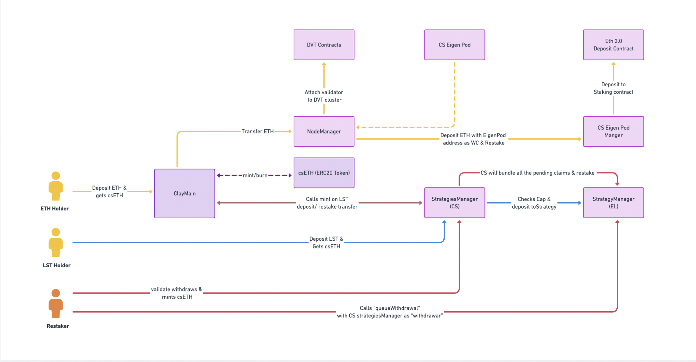

# csETH Re-staking 
Claystack's csETH introduces re-staking functionality via EigenLayer, offering csETH holders the chance to earn EigenLayer points alongside CLAY points. By actively engaging in restaking on the EigenLayer protocol, Claystack presents users with diverse avenues for restaking participation. Whether users hold ETH, are LST holders, or already engage in restaking, they can seamlessly mint csETH, initiating their journey to earning EigenLayer points in tandem with CLAY points.

The distribution of these accrued points aligns with individual csETH holdings, providing users with a clear overview of their EigenLayer rewards alongside CLAY points through Claystack's staking dashboard.

Unlike other LST tokens deposited on EigenLayer, csETH remains unlocked, affording users the flexibility to leverage it across various DeFi protocols while reaping the benefits of dual rewards in CLAY and EigenLayer points.

Existing csETH holders won't need to take any action to initiate restaking; they'll automatically commence earning EigenLayer points once Claystack releases the restaking feature. For newcomers, simply depositing ETH, LST, or transferring restake positions and minting csETH kickstarts their journey toward earning dual rewards effortlessly.

### Native Re-staking 
ETH holders can deposit ETH directly into Claystack to mint csETH and restake via EigenLayer's native restaking method. This enables ETH holders to earn EigenLayer points alongside CLAY points, as Claystack actively participates in restaking on the EigenLayer protocol. Notably, the use of native restaking by Claystack's csETH eliminates any maximum deposit cap. This means users can restake any amount of ETH, allowing them to earn restaking points on the entirety of their staked ETH without limitations.

It's essential to understand that Claystack employs EigenLayer's Native Re-staking for the restaking of ETH. For a comprehensive understanding of this process, users can refer to EigenLayer's [documentation](https://docs.eigenlayer.xyz/restaking-guides/restaking-user-guide/native-restaking), providing valuable insights into the EigenLayer protocol.

For csETH holders, the native restaking process seamlessly integrates into their user experience, ensuring a user-friendly approach. This integration allows users to enjoy rewards effortlessly, with minimal changes to their staking routine. Notably, csETH holders won't need to take any additional actions to activate restaking. The ClayStack contracts autonomously handle the restaking of ETH, ensuring the continual accrual of staking rewards.

Note: The Native restaking mechanism from EigenLayer will eventually serve as the foundational restaking process in Claystack for all types of deposits, including LST deposits and re-stake transfers.

### LST Re-staking 

Claystack now accepts LSTs such as stETH, mETH, etc., to mint csETH and participate in restaking via EigenLayer. Upon depositing LST, csETH is minted to the user based on the current csETH rate, allowing users to hold the liquid staking token and participate in restaking simultaneously.

Claystack will whitelist supported LSTs for deposits. Upon release, Claystack will accept stETH, wbETH, cbETH, mETH, with more LSTs to be added in the coming days.

Note: LST deposits will depend entirely on EigenLayer caps for respective whitelisted LSTs.

Once EigenLayer uncaps the supported LSTs, users can deposit the whitelisted LSTs and mint csETH. Eigen layer token uncapping the respective LSTs is crucial as the deposited amount of LST will be directly restaked to EigenLayer in its entirety. This allows LST holders to earn EigenLayer points along with Clay points while keeping csETH as a liquid staking token, facilitating further DeFi participation.

users can refer to EigenLayer's  [documentation] (https://docs.eigenlayer.xyz/eigenlayer/restaking-guides/restaking-user-guide/liquid-restaking/) for more information.

### Re-stake Transfer

Existing Eigen Layer re-stakers can also engage in Claystack restaking, earning dual rewards by transferring their restake position to Claystack. Upon the transfer of the position, csETH is minted for the user, enabling them to continue restaking while holding the liquid token (csETH) simultaneously. There are no caps on re-stake transfers, allowing users to transfer their restaking position to Claystack and begin earning Clay points alongside Eigen Layer points.

The re-stake transfer process will be a two-step procedure. Firstly, users need to request a queue withdrawal in Eigen Layer, specifying Claystack as the withdrawar. Following this, users can mint csETH. Claystack will internally batch all claims and restake them on Eigen Layer.

Note: All deposited LSTs or LSTs transferred through restaking will undergo a conversion process back to ETH, subsequently being restaked via Eigen Layer's Native restaking. Presently, tokens are not converted to prevent the loss of Eigen Layer points. However, in the near future, Claystack will internally handle the conversion process, eliminating the need for users to take any additional actions.