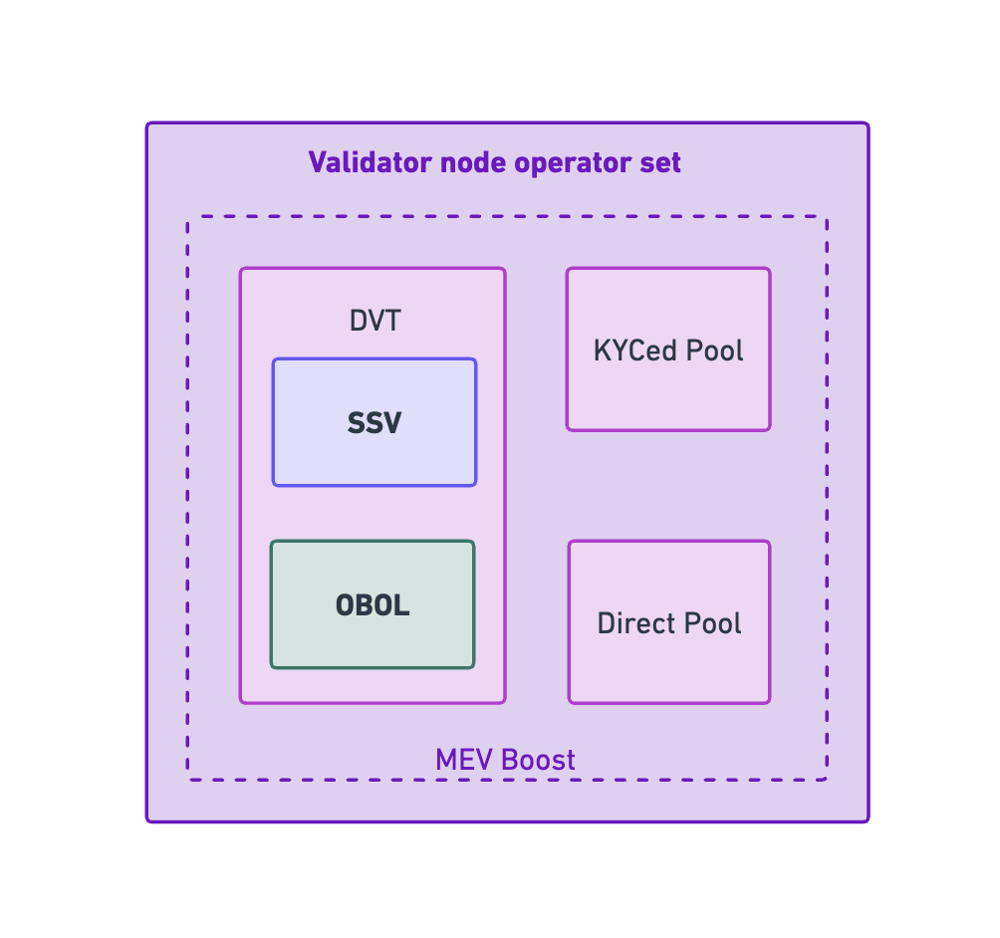

# DVT Modular Validation

### DVT Modules

Distributed Validator Technology (DVT) is an innovative approach to network security and decentralization. It operates by distributing validation responsibilities among several participants, instead of centralizing them with a single validator. This ensures that no single entity has complete control over the validation process, thus enhancing the security and decentralization of the network.

Combining several DVTs provides a layer of redundancy and further decentralization. If one DVT experiences issues or failures, others can continue the validation process uninterrupted, ensuring the network's stability and reliability. This redundancy is critical in maintaining the integrity and trustworthiness of the network.

Moreover, the integration of multiple DVTs fosters a more diverse and inclusive validator ecosystem. It allows for greater participation from different types of validators, ranging from individual home stakers to major institutions. This inclusivity strengthens the decentralization of the network, as it prevents any single group or entity from dominating the validation process. By combining several DVTs, we can create a more robust, resilient, and democratic network.

### SSV Integration

The integration of Secret Shared Validators (SSV) into csETH's suite of Distributed Validator Technologies (DVT) marks a significant advancement for the platform, setting it apart from other liquid staking derivatives. SSV technology facilitates the division of a validator's key into multiple parts, each under the management of a different entity. This unique approach to key management not only enhances the security of the network but also substantially improves its decentralization and censorship resistance.

- Increased Security: By splitting the validator's key among multiple entities, the risk of a single point of failure is drastically reduced. Even if one entity is compromised, the others remain secure, ensuring the continued functioning and integrity of the validator.

- Enhanced Decentralization: The distributed nature of SSV promotes a more decentralized network. Since no single entity has complete control over a validator, it becomes nearly impossible for any one party to manipulate the system or gain disproportionate influence.

- Fault Tolerance: SSV improves the network's resilience in the face of potential errors or failures. If an entity managing a part of the validator key goes offline or experiences issues, the other parts can continue the validation process unhindered, minimizing disruptions.

- Democratic Participation: SSV allows for broader participation in the validation process. This not only enhances the inclusivity of the network but also fosters a more democratic and balanced ecosystem.

### Obol Integration

The integration of Obol into csETH's Distributed Validator Technologies (DVT) offers an extra layer of decentralization and security. Obol is a technology that empowers a network of operators to host and maintain decentralized infrastructure in a truly distributed fashion.

- Distributed Infrastructure Management: Obol enables a network of operators to collaboratively host and maintain the infrastructure required for running csETH's decentralized protocol. This approach to infrastructure management enhances the resilience and fault tolerance of the system, reducing dependencies on single points of failure.

- Decentralization at Scale: Obol's technology facilitates large-scale decentralization. It allows for a massive number of operators to participate in the system, significantly increasing the robustness and diversity of the network.

- Security and Trust: By distributing infrastructure management across a broad network of operators, Obol enhances the overall security of the system. It minimizes the risk associated with central points of control and promotes trust in the protocol.

### Private & Public Pools

The integration of both private and public professional pools of nodes for validation within csETH is a groundbreaking development in the realm of liquid staking derivatives. Operators are able to provide ETH for staking while simultaneously taking advantage of the benefits of a liquid staking derivative. This integration introduces a novel layer of versatility and scalability to Ethereum staking.

- Scalability: With the integration of professional node pools, csETH can handle a higher volume of transactions and network interactions, allowing for enhanced growth and scalability. This is especially beneficial for large institutions that operate at a high scale and require a system capable of managing heavy workloads.

- Fungibility: csETH tokens maintain the same value regardless of the specific node pool they are staked in. This allows for seamless trading and swapping of csETH tokens, enhancing liquidity and providing greater flexibility for token holders.

- Compounding: csETH supports compound interest, enabling validators to automatically reinvest their rewards for exponential growth. This is particularly appealing to institutional investors, as it maximizes their return on investment.

- DeFi Integration: csETH tokens can be readily integrated into various DeFi protocols, allowing validators to participate in yield farming, lending, and other DeFi activities. This gives them the potential to earn additional yield on their staked ETH.

- Institutional-Grade Security: csETH adheres to strict institutional requirements to ensure the highest level of security. It implements rigorous protocols to protect against risks such as double signing and slashing penalties.

- Decentralization: Despite the professional nature of these node pools, csETH's commitment to decentralization remains. This ensures a broad and diverse network of validators, strengthening the overall security and resilience of the system.
