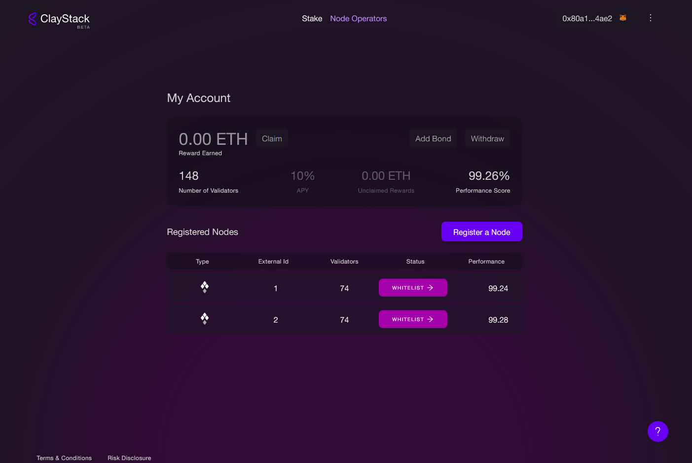

# SSV Guide

To onboard your node with ClayStack during the whitelist SSV mainnet phase, follow the steps outlined below. Upon successfully completing the preceding steps, your nodes will become eligible to receive delegations from the ClayStack pool. For SSV nodes, rewards payment is in ETH, which can be withdrawn through ClayStack's Node Management Dashboard.

### Step 1: Verify Whitelisting in SSV
Ensure that you have received operator whitelist status by registering directly through SSV.

### Step 2: Set Up Your SSV Node
Set up your client and register your new SSV node. You will need your operator ID to register the node with ClayStack.

### Step 3: Register with ClayStack's Node Management Dashboard
Register your operator ID on ClayStack's Node Management Dashboard. Make sure to use the same owner account as in SSV for successful verification. Rewards will be claimed using this address exclusively.

https://app.claystack.com/nodes

### Step 4: SSV Node Settings
For the new SSV node, ensure the following conditions are set:

#### Step 4.1 Add ClayStack to the Whitelist
Add ClayStack's node management contract to the whitelist. This can be accomplished by calling the setOperatorWhitelist function on the SSVNetwork.sol smart contract. You can also trigger the transaction directly from ClayStack's dashboard.

For testnet:
```agsl
"claystack_goerli": "0xF686837140B19113b598e7EC32a6405E61bc0FaB"
```
For mainnet:
```agsl

"claystack_mainnet": "0x87393BE8ac323F2E63520A6184e5A8A9CC9fC051"
```
#### Step 4.2 Set 0% SSV Fees
Set your SSV node fee to zero. Node operator fees will be paid in ETH to the node operator, and you can claim rewards using the ClayStack Node Operator Admin Dashboard.

- First, call `declareOperatorFee`
- Then, execute `executeOperatorFee`

#### Step 4.3 Active Node
Ensure your node is active and ready for inclusion in a validation cluster.

### Step 5: Review the Service-Level Agreement (SLA)
ClayStack will provide you with a Service-Level Agreement (SLA). To proceed with delegation, both parties must agree to the terms outlined in the SLA. Carefully review the SLA and its conditions, confirming your acceptance with ClayStack.

### Node Registration Guide

1. Visit the ClayStack Admin Dashboard website and connect using your admin wallet. 


2. Select the SSV network from the options.


3. The dashboard displays all your registered operators. To register a new operator, click on "Register a Node."


4. Register the node using the SSV node operator ID.


5. Whitelist ClayStack for registered node


