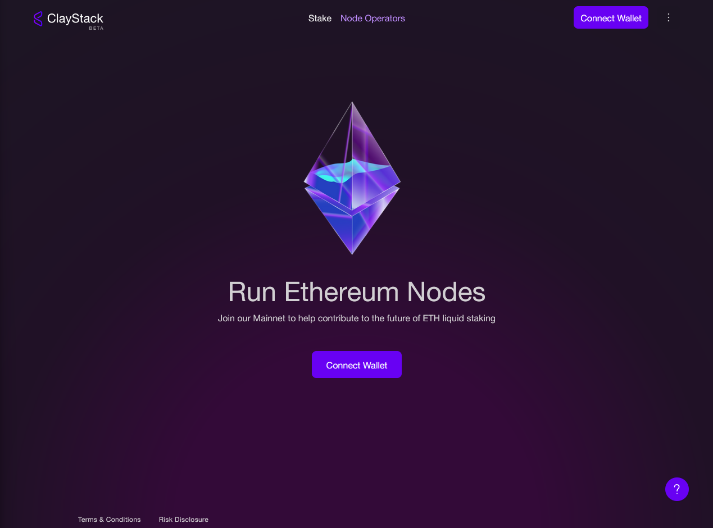

# SSV Guide

### How to Onboard Your Node to ClayStack
To onboard your node with ClayStack, follow these steps:

#### Step 1: Verify Whitelisting in SSV
Ensure that you have received operator whitelist status within the Secret Shared Validators (SSV) network.

#### Step 2: Set Up Your SSV Node
Run SSV node(s) for ClayStack.For detailed instructions, refer to the Onboarding Guide. When configuring a new node in SSV for ClayStack, adhere to the following conditions:

1. Register your node as a private node, allowing only ClayStack to delegate.
2. Set your SSV node fee to zero. Node operator fees will be paid in ETH to the node operator, and you can claim rewards using the ClayStack Node Operator Admin Dashboard.
3. Ensure your node is active and ready for inclusion in a validation cluster.
4. Activate notifications to stay informed about alerts from ClayStack.

#### Step 3: Register with ClayStack's Node Management Dashboard
Register your public key with ClayStack to request whitelisting as an administrator. This step is crucial for managing and updating your SSV node within ClayStack.

Note: Register using the same owner account as in SSV on ClayStack's Node Management Dashboard. Rewards will be claimed using this address exclusively.

Follow these steps to add a new node:

1. Visit the ClayStack Admin Dashboard website and connect using your admin wallet.

2. Select the SSV network from the options.

3. The dashboard displays all your registered operators. To register a new operator, click on "Register a Node."

4. Register the node using the SSV node operator ID.

#### Step 4: Review the Service-Level Agreement (SLA)
ClayStack will provide you with a Service-Level Agreement (SLA). To proceed with delegation, both parties must agree to the terms outlined in the SLA. Carefully review the SLA and its conditions, confirming your acceptance with ClayStack.

#### Step 5: Completion of Onboarding
Upon successfully completing the preceding steps, your nodes will become eligible to receive delegations from the ClayStack pool.

[//]: # (TODO: Expand on the notification system)

<!-- ### SSV Initial Bond Requirement

ClayStack's implementation of SSV includes 4 nodes for each validator. The initial bond requirement to run the first node is 1 ETH. Subsequent nodes will require progressively less based on performance metrics. -->

### SSV Token Payments & Rewards

ClayStack offers competitive yields for operators through dynamic bond requirements and rewards sharing. Operators who provide quality uptime and active participation will receive good performance scores, which in turn increases their node allocation and returns.

For SSV nodes, the rewards payment is in ETH compounded and reinvested as csETH, which can be withdrawn at any time. For withdrawal of rewards node operator can use ClayStack's Node Management Dashboard.
