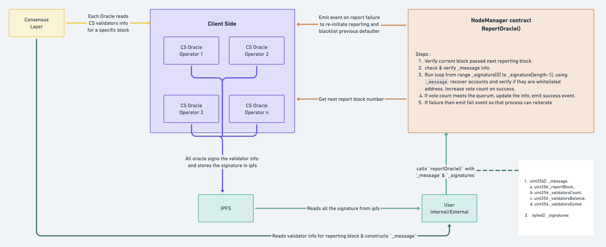

# csETH Oracle

The CsETH oracle, developed by Claystack after extensive research and development, is a highly efficient, decentralized, and secure solution. Its primary function is to ensure the timely and accurate updating of crucial information regarding Claystack validator nodes, transferring data from the consensus layer to the main chain (execution layer). The CsETH oracle specifically handles the update of information such as validator balances and exchange rates. This update process occurs approximately every 24 hours.

The CsETH oracle is designed to be run by any user, even on low-end machines, making it a cost-effective option. Initially, the oracle will be operated exclusively by Claystack. However, there are plans to open doors for external entities in the future, allowing for the whitelisting of oracle operators beyond Claystack's team.



## How it works

### Oracle Operators
The Oracle operators retrieve the next block number for reporting from the Claystack NodeManager contract, which determines the validators' information to be fetched. Each operator maintains a list of Claystack validators for which they need to fetch information. Using the consensus layer APIs, each operator extracts the relevant information for each validator at the specified block.

Once the operator has gathered the validator information, they curate it into the required format. Subsequently, they generate a signature by signing the curated data using their own keys. To ensure security during signature generation, the operators employ the ECDSA (Elliptic Curve Digital Signature Algorithm).

Upon generating the signature, the operators proceed to write it onto IPFS (InterPlanetary File System) for storage and accessibility. This process ensures that the generated signatures are securely stored and readily available for verification and further usage.

### Oracle contract 
Claystack's NodeManager contract incorporates the Oracle functionality for on-chain operations. This contract includes important states that are dependent on the Oracle, such as a list of whitelisted oracle operator addresses, the quorum requirement, and the next block number for oracle reporting.

The Oracle reporting function in the NodeManager smart contract is publicly accessible, allowing anyone to call the function. However, callers must provide the correct information as a message for the corresponding block from the consensus layer. Additionally, they need to gather the signatures of the whitelisted oracle operators from IPFS. Only when all the required information is gathered can the oracle reporting function be called on the NodeManager.

Upon calling the reporting function, various metadata checks are performed to ensure the legitimacy of the data. Each signature is examined for faults and double usage to maintain uniqueness and security. Subsequently, each signature is used to recover the signer based on the given parameters, which include the original message containing the reporting information. If the recovered signer is recognized as a whitelisted oracle operator, the number of votes is incremented.

Once the number of votes reaches the required quorum, the provided information is considered legitimate and is updated in the smart contract. However, if the votes do not meet the quorum, an event is emitted to indicate the update failure. The oracle operators, who constantly monitor these events, listen for the event and initiate the re-updating process with the correct information by restarting the entire procedure.

## Oracle reporting function in NodeManager.sol

### oracleReport() : 
Consensus layer oracle report on validators and balances.

#### Function signature
```sol
function oracleReport(
        uint256[] calldata _message,
        bytes[] calldata _signatures
    )
```

#### Parameters:

| Name      | Description                  |
| --------- | ---------------------------- |
| `_message` | Original message used for signature generation. |
| `_signatures` | whitelisted oracle signatures. |


#### `_message` structure:

| Name         |  Description                  |
| ------------ |  ---------------------------- |
| `_reportBlock` |  Block number of the report. |
| `_validatorsCount` | Number of validators on Consensus Layer. |
| `_validatorsBalance` | Total balance of active validators on Consensus Layer. |
| `_validatorsExited` | Number of validators exited. |


#### Event emitted
```sol
    event LogOracleReport(
        uint256 reportTimestamp,
        uint256 validatorsCount,
        uint256 validatorsBalance,
        uint256 validatorsExited
    );
```

```sol
 event LogOracleReportFailure(
        address indexed oracle,
        uint256 reportTimestamp,
        uint256 validatorsCount,
        uint256 validatorsBalance,
        uint256 validatorsExited
    );
```

