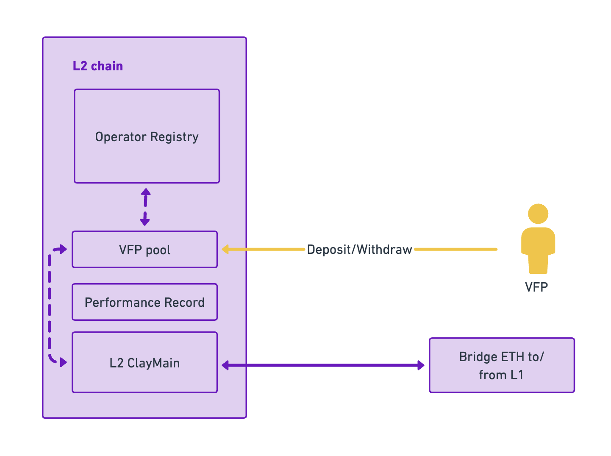

# VFP

ClayStack is committed to achieving complete decentralization within the Ethereum network by eliminating the high bond entry barrier for running a validator. This objective is made possible through a decentralized protocol that evaluates performance, underwrites risk, and allows anyone to provide ETH liquidity to validators to meet the bond requirement as well as insurance for csETH holders.

This automated approach, combined with an algorithmic method for validator slot selection, helps maintain a balanced network across DVT modules and validator types, providing capital efficiency for node operators, stakers, and liquidity providers.

### How it works

ClayStack's innovative approach helps reduce the bond requirement for validators. When a validator consistently shows excellent performance, the algorithm acknowledges their proficiency and accordingly reduces the bond requirement. This adjustment encourages broader participation in the validation process, enabling more individuals to become validators and contribute to the decentralized nature of the Ethereum network.

In addition to validators, ClayStack recognizes those individuals who are willing to take on higher risks and rewards than traditional delegators. These individuals, known as Validator Fund Providers (VFPs), benefit from a separate pool created specifically for them. VFPs can contribute their ETH to this pool, which is then used to fulfill the validator bond requirement if the algorithm determines that the validator is skilled enough to effectively use these funds. This innovative mechanism enables validators to operate multiple nodes with the same bond amount that was previously required for a single node.

VFPs receive incentives in the form of rewards for their active participation. By providing liquidity to the high-risk pool, VFPs earn VEF (Validator Equity Fund) shares, giving them a share of the direct rewards generated by validators. This setup allows VFPs to earn higher rewards compared to traditional delegators, reflecting the increased risk they accept.

It's important to note that VFPs also share the associated risks with validators. If a validator fails to meet the required performance standards, resulting in penalties being applied to their node, VFPs will also bear the impact of these penalties. This ensures that VFPs have a vested interest in selecting competent validators and actively monitoring the validators they have invested in.
