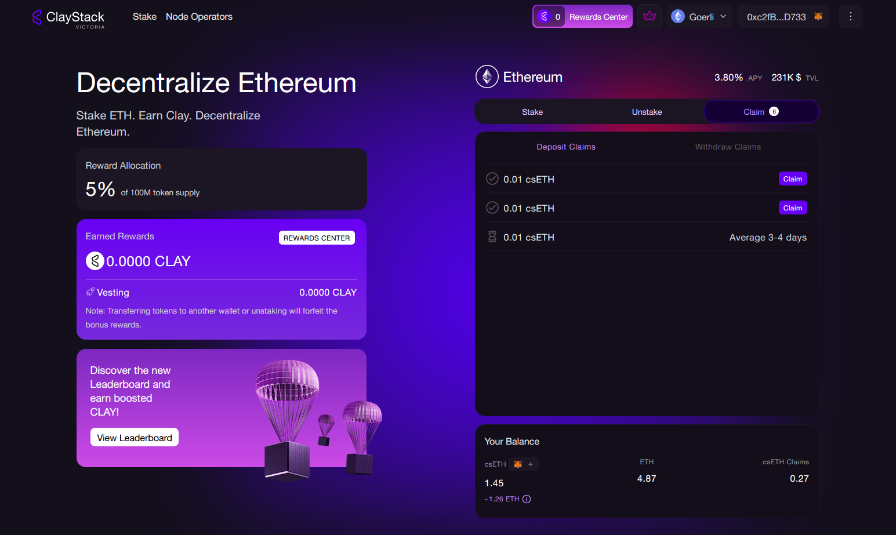
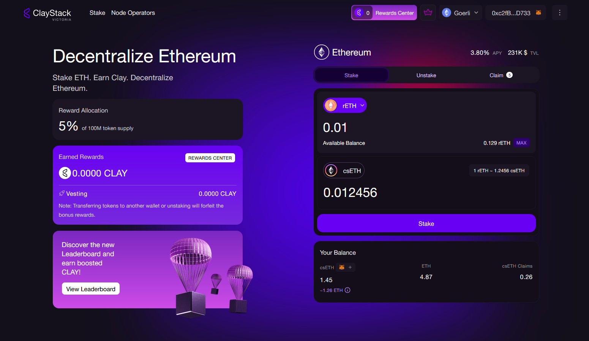

# Mint csETH via LSDs

ClayStack allows users to mint csETH by depositing LSDs directly. Presently, ClayStack supports two major LSDs in the market: stETH and rETH. Upon depositing LSDs, users receive csETH at the current corresponding token rate of the deposited LSD.

The process involves converting each deposited LSDs back to ETH tokens, which are then deposited into ClayStack. Subsequently, ClayStack mints csETH tokens for depositors in exchange.

## How to Mint csETH with LSDs

### stETH

stETH represents Liquid Staked Ether from Lido. Users can mint csETH by depositing stETH. The stETH deposit undergoes a conversion process to ETH through the official unstaking mechanism provided by Lido. Minting csETH using stETH involves a two-step process. Initially, users stake stETH to ClayStack, triggering an unstaking request to the stETH smart contract. The official unstaking requires users to wait for an unbonding period. After the unbonding period, users need to claim their order. Upon claiming, the ETH is transferred to ClayStack, and csETH tokens are minted for the user.

### Steps to Mint csETH using stETH

1. Navigate to ClayStack's staking app, and choose stETH in the stake tab.
2. Enter the amount of tokens to be deposited & approve the tokens.
3. Click 'Stake'.

<figure><figcaption></figcaption></figure>

Note: Wait for the Unbonding Period.

4. After the unbonding period, navigate to the Claim tab, and click 'Claim' on respective order.&#x20;

<figure><figcaption></figcaption></figure>

### rETH

rETH represents Liquid Staked Ether from RocketPool. Users can deposit rETH directly to mint csETH. The deposited rETH undergoes an instantaneous conversion to ETH using the official "staking liquidity pool." In the same transaction, rETH is converted to ETH, which is then deposited into ClayStack, resulting in the immediate minting of csETH for the user.

Note: Ensure the liquidity pool has sufficient liquidity for seamless transactions.

### Steps to Mint csETH using rETH

1. Navigate to ClayStack's staking app, and choose rETH in the stake tab.
2. Enter the amount of tokens to be deposited, and approve the tokens.
3. Click 'Stake'.&#x20;

<figure><figcaption></figcaption></figure>
